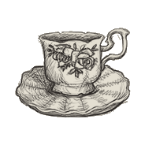
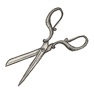

# Memory Game

In this exercise, you will create a simple [memory game](https://en.wikipedia.org/wiki/Concentration_(card_game)).

In a memory game, several pairs of tiles are placed face down in a grid. The point of the game is to flip over tiles and match the pairs together. If the images on the facing tiles match, the matching tiles are removed. If the images do not match, the tiles are flipped back face down. The object of the game is to find all pairs. The game is over when all the tiles are gone.

## Requirements

* The game must offer the ability to be rendered with different sizes of the grid, 4x4, 4x2, and 2x2.
* The player has to be able to flip the tiles with the mouse and keyboard.
* The player must only be able to flip two tiles face up at a time.
* After a suitable time, matching tiles that face up must not have a visible representation in the grid.
* After an appropriate time, tiles facing up and not matching must be flipped face down.
* The positions, or rather the images, of the tiles in the grid must be randomized before each game round.
* Throughout a game round, the tiles must retain their original positions in the grid.
* Fire synthetic events when tiles match, do not match, and when a game round is over.
* The game must count how many attempts the player has made to find matching tiles and present the number of attempts when the game round is over.
* After a game round is over, the user must be allowed to start a new game round without having to reload the page.

## Hints

* Get to know the problem by thinking through the different cases that can arise during a game. Pen and paper are useful!
* Use the web component created in a previous exercise to represent a flipping tile.
* A web component can contain other web components just like any other HTML element.
* Why not create the grid containing the tiles with [CSS grid layout](https://developer.mozilla.org/en-US/docs/Web/CSS/CSS_Grid_Layout)?
* By using [Node.isEqualNode()](https://developer.mozilla.org/en-US/docs/Web/API/Node/isEqualNode) it is easy to make it possible for one tile to compare with another tile to see if they are the same.
* Do not shuffle the tiles, shuffle the images that the tiles display, and do not forget to duplicate each image before the shuffling starts.
* Think through how many event listeners, that listens for when a tile is flipped, you really need to be able to implement the game logic.
* Build the URLs of the images displayed by the tiles once and for all. [URL](https://developer.mozilla.org/en-US/docs/Web/API/URL/URL) objects and [import.meta.url](https://developer.mozilla.org/en-US/docs/Web/JavaScript/Reference/Statements/import.meta) can be used in the building process.
* Do not add additional functionality, such as a timer including perhaps a high score list, until all requirements are met.

## Credits

* Thank you Moa Alfredsson for allowing us to use your images.
  
  

    
    
    
    
    
    
    
    
    
  

